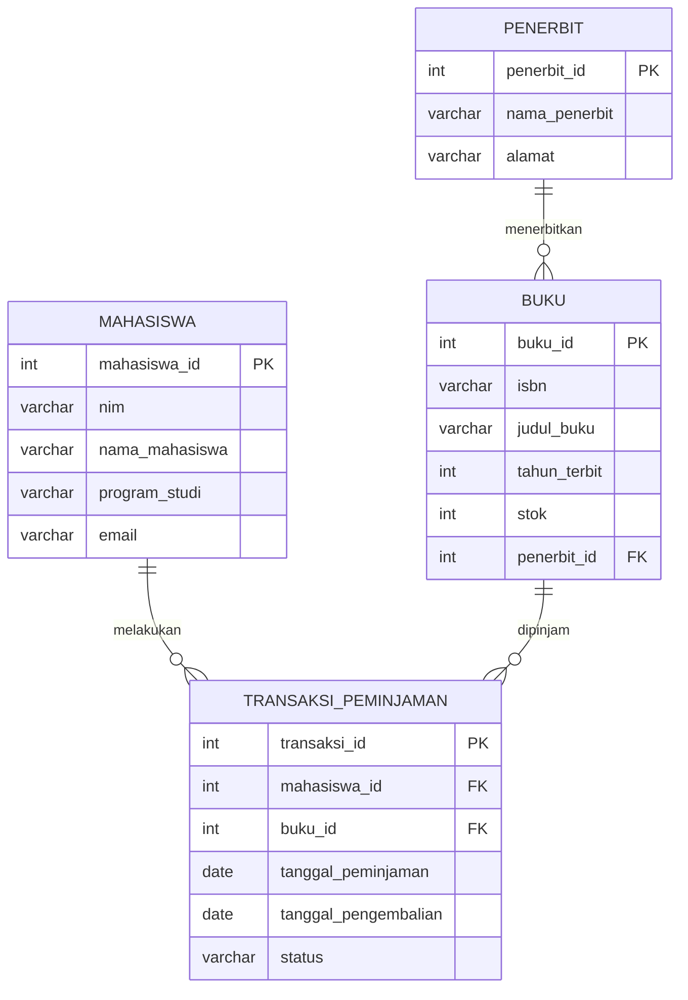

# Perancangan ERD E-Library Kampus

**Nama:** Nahdah Fauziah Chaidir 
**NIM:** D121241099  
**Link Repository:** (https://github.com/nahdahchaidir/tugas-modul-6.git)

## 1. Deskripsi

E-Library Kampus adalah sistem yang digunakan untuk menyimpan data mahasiswa, buku, penerbit, serta transaksi peminjaman dan pengembalian buku.

Entitas yang digunakan:
- Mahasiswa
- Buku
- Penerbit
- Transaksi Peminjaman

## 2. Entitas dan Atribut

### Mahasiswa
- `mahasiswa_id` (PK)
- `nim`
- `nama_mahasiswa`
- `program_studi`
- `email`

### Buku
- `buku_id` (PK)
- `isbn`
- `judul_buku`
- `tahun_terbit`
- `stok`
- `penerbit_id` (FK)

### Penerbit
- `penerbit_id` (PK)
- `nama_penerbit`
- `alamat`

### Transaksi Peminjaman
- `transaksi_id` (PK)
- `mahasiswa_id` (FK)
- `buku_id` (FK)
- `tanggal_peminjaman`
- `tanggal_pengembalian`
- `status`

## 3. Normalisasi

### UNF

Pada UNF, semua data masih dicatat dalam satu tabel dan dapat terdapat data yang berulang.

| ID Transaksi | NIM | Nama Mahasiswa | Buku | Penerbit | Tanggal Pinjam | Tanggal Kembali |
|---|---|---|---|---|---|---|
| TR001 | H071001 | Nahdah | Basis Data, Jaringan Komputer | Unhas Press, Erlangga | 01-10-2026 | 08-10-2026 |

Masalahnya adalah satu kolom dapat memiliki lebih dari satu nilai.

### 1NF

Pada 1NF, setiap kolom hanya memiliki satu nilai.

| ID Transaksi | NIM | Nama Mahasiswa | Buku | Penerbit | Tanggal Pinjam | Tanggal Kembali |
|---|---|---|---|---|---|---|
| TR001 | H071001 | Nahdah | Basis Data | Unhas Press | 01-10-2026 | 08-10-2026 |
| TR001 | H071001 | Nahdah | Jaringan Komputer | Erlangga | 01-10-2026 | 08-10-2026 |

### 2NF

Pada 2NF, data yang tidak bergantung langsung pada transaksi dipisahkan.

Tabel yang dihasilkan:
- Mahasiswa
- Buku
- Penerbit
- Transaksi Peminjaman

Contohnya, nama mahasiswa tidak perlu disimpan berulang pada transaksi karena sudah disimpan di tabel Mahasiswa.

### 3NF

Pada 3NF, tidak ada ketergantungan antar atribut non-key.

Data penerbit dipisahkan dari tabel Buku sehingga tabel Buku hanya menyimpan `penerbit_id` sebagai FK.

Hasil akhirnya adalah:

```text
Mahasiswa
Penerbit
Buku
Transaksi Peminjaman
```

## 4. ERD



## 5. Rancangan Tabel Akhir

### Tabel Mahasiswa

| Field | Tipe Data | Key |
|---|---|---|
| mahasiswa_id | INT | PK |
| nim | VARCHAR(20) | UNIQUE |
| nama_mahasiswa | VARCHAR(100) | - |
| program_studi | VARCHAR(100) | - |
| email | VARCHAR(100) | - |

### Tabel Penerbit

| Field | Tipe Data | Key |
|---|---|---|
| penerbit_id | INT | PK |
| nama_penerbit | VARCHAR(100) | - |
| alamat | TEXT | - |

### Tabel Buku

| Field | Tipe Data | Key |
|---|---|---|
| buku_id | INT | PK |
| isbn | VARCHAR(20) | UNIQUE |
| judul_buku | VARCHAR(200) | - |
| tahun_terbit | INT | - |
| stok | INT | - |
| penerbit_id | INT | FK |

### Tabel Transaksi Peminjaman

| Field | Tipe Data | Key |
|---|---|---|
| transaksi_id | INT | PK |
| mahasiswa_id | INT | FK |
| buku_id | INT | FK |
| tanggal_peminjaman | DATE | - |
| tanggal_pengembalian | DATE | - |
| status | VARCHAR(20) | - |

## 6. Relasi

```text
PENERBIT 1 ─────── N BUKU

MAHASISWA 1 ─────── N TRANSAKSI_PEMINJAMAN

BUKU 1 ─────── N TRANSAKSI_PEMINJAMAN
```

## 7. Kesimpulan

ERD E-Library terdiri dari empat tabel utama yaitu Mahasiswa, Buku, Penerbit, dan Transaksi Peminjaman. Setiap tabel memiliki primary key, sedangkan hubungan antar tabel menggunakan foreign key.

Rancangan ini telah dinormalisasi dari UNF sampai 3NF untuk mengurangi pengulangan data dan menjaga konsistensi data.
