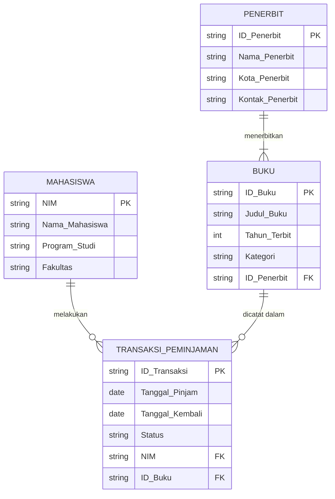

# Tugas Mandiri: Perancangan ERD E-Library Kampus

## 1. Identifikasi Entitas dan Atribut

- **Mahasiswa**: `NIM` (PK), Nama_Mahasiswa, Program_Studi, Fakultas.
- **Penerbit**: `ID_Penerbit` (PK), Nama_Penerbit, Kota_Penerbit, Kontak_Penerbit.
- **Buku**: `ID_Buku` (PK), Judul_Buku, Tahun_Terbit, Kategori, `ID_Penerbit` (FK).
- **Transaksi_Peminjaman**: `ID_Transaksi` (PK), Tanggal_Pinjam, Tanggal_Kembali, Status, `NIM` (FK), `ID_Buku` (FK).

*(Catatan: Dalam perancangan final ini, digunakan asumsi 1 transaksi mencatat 1 peminjaman buku agar sesuai dengan spesifikasi 4 entitas utama yang diminta. Jika 1 transaksi meminjam banyak buku, maka akan dipecah menjadi `Transaksi` dan `Detail_Transaksi`).*

## 2. Simulasi Normalisasi

### Unnormalized Form (UNF)
Bentuk tidak normal dimana data masih memiliki grup berulang (*repeating groups*) atau *multivalue* dalam satu baris, misalnya sebuah log atau struk peminjaman perpustakaan.

| ID_Transaksi | Tanggal_Pinjam | Tanggal_Kembali | NIM | Nama_Mahasiswa | Program_Studi | ID_Buku | Judul_Buku | Tahun_Terbit | ID_Penerbit | Nama_Penerbit | Kota_Penerbit |
|---|---|---|---|---|---|---|---|---|---|---|---|
| TRX001 | 2023-10-01 | 2023-10-08 | 1011 | Budi | Informatika | BK01, BK02 | Basis Data, Jaringan | 2021, 2020 | P01, P02 | Andi, Informatika Press | Jogja, Bandung |

### First Normal Form (1NF)
Setiap atribut/kolom harus bernilai atomik (tidak ada *repeating groups*).

| ID_Transaksi | Tanggal_Pinjam | Tanggal_Kembali | NIM | Nama_Mahasiswa | Program_Studi | ID_Buku | Judul_Buku | Tahun_Terbit | ID_Penerbit | Nama_Penerbit | Kota_Penerbit |
|---|---|---|---|---|---|---|---|---|---|---|---|
| TRX001 | 2023-10-01 | 2023-10-08 | 1011 | Budi | Informatika | BK01 | Basis Data | 2021 | P01 | Andi | Jogja |
| TRX001 | 2023-10-01 | 2023-10-08 | 1011 | Budi | Informatika | BK02 | Jaringan | 2020 | P02 | Informatika Press | Bandung |

### Second Normal Form (2NF)
Telah memenuhi 1NF, dan semua atribut *non-key* bergantung penuh pada *Primary Key* (menghilangkan *partial dependency*).
- **Tabel Transaksi_Detail**: `ID_Transaksi` (PK), `ID_Buku` (PK), Tanggal_Pinjam, Tanggal_Kembali, NIM, Nama_Mahasiswa, Program_Studi
- **Tabel Buku**: `ID_Buku` (PK), Judul_Buku, Tahun_Terbit, ID_Penerbit, Nama_Penerbit, Kota_Penerbit

### Third Normal Form (3NF)
Telah memenuhi 2NF, dan tidak ada atribut *non-key* yang bergantung pada atribut *non-key* lainnya (menghilangkan *transitive dependency*).
- **Tabel Mahasiswa**: `NIM` (PK), Nama_Mahasiswa, Program_Studi
- **Tabel Penerbit**: `ID_Penerbit` (PK), Nama_Penerbit, Kota_Penerbit
- **Tabel Buku**: `ID_Buku` (PK), Judul_Buku, Tahun_Terbit, `ID_Penerbit` (FK)
- **Tabel Transaksi_Peminjaman**: `ID_Transaksi` (PK), Tanggal_Pinjam, Tanggal_Kembali, `NIM` (FK), `ID_Buku` (FK) *(Sesuai dengan 4 entitas, setiap transaksi menyimpan 1 ID_Buku).*

## 3. Rancangan Tabel Akhir (Format Markdown)

### Tabel Mahasiswa
| Nama Kolom | Tipe Data | Keterangan |
|---|---|---|
| NIM | VARCHAR(15) | Primary Key |
| Nama_Mahasiswa | VARCHAR(100) | Not Null |
| Program_Studi | VARCHAR(50) | Not Null |
| Fakultas | VARCHAR(50) | Not Null |

### Tabel Penerbit
| Nama Kolom | Tipe Data | Keterangan |
|---|---|---|
| ID_Penerbit | VARCHAR(10) | Primary Key |
| Nama_Penerbit | VARCHAR(100) | Not Null |
| Kota_Penerbit | VARCHAR(50) | Not Null |
| Kontak_Penerbit | VARCHAR(20) | Nullable |

### Tabel Buku
| Nama Kolom | Tipe Data | Keterangan |
|---|---|---|
| ID_Buku | VARCHAR(10) | Primary Key |
| Judul_Buku | VARCHAR(255) | Not Null |
| Tahun_Terbit | INT | Not Null |
| Kategori | VARCHAR(50) | Not Null |
| ID_Penerbit | VARCHAR(10) | Foreign Key |

### Tabel Transaksi_Peminjaman
| Nama Kolom | Tipe Data | Keterangan |
|---|---|---|
| ID_Transaksi | VARCHAR(15) | Primary Key |
| Tanggal_Pinjam | DATE | Not Null |
| Tanggal_Kembali | DATE | Nullable |
| Status | VARCHAR(20) | Not Null (e.g., Dipinjam, Dikembalikan) |
| NIM | VARCHAR(15) | Foreign Key |
| ID_Buku | VARCHAR(10) | Foreign Key |

## 4. Visualisasi Relasi Kunci (ERD)

